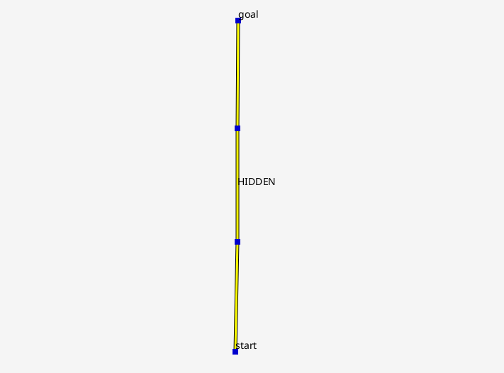
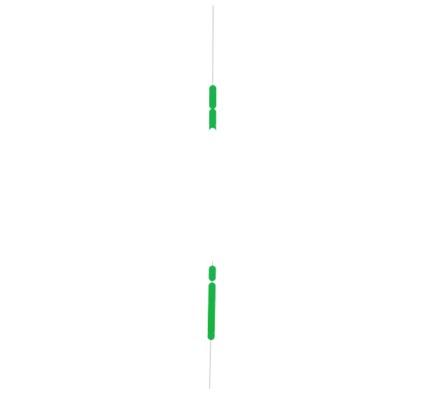

# Hide Links
特定のリンクと通行するエージェントを隠す

## Map



## Design
- HIDDENタグを付けたリンクを表示しない
- HIDDENタグを付けたリンクを通行中のエージェントの表示色を白にする

## Note
3Dビューワは，色の更新タイミングに不具合があるため，HIDDEN区間でエージェントの色が付いたままになることがある．

## Implementation
### Link Appearance
`prop.json`
```json
"link_appearance_file":"link_appearance.json",
```

`link_appearance.json`
```json
{
    "tag" : "HIDDEN",
    "2D_View" : {
        "className" : "FixedWidth2D",
        "parameters" : {
            "width" : 0.0,
            "color" : "WHITE",
            "transparency" : 1.0,
            "method" : "filling"
        }
    },
    "3D_View" : {
        "className" : "FixedWidth3D",
        "parameters" : {
            "width" : 0.0,
            "color" : "WHITE",
            "transparency" : 1.0,
            "method" : "filling"
        }
    }
},
...
```

### Agent Appearance
`prop.json`
```json
"agent_appearance_file":"agent_appearance.json",
"use_ruby": true,
"ruby_init_script":"require './HideableAgentColor.rb'",
```

`agent_appearance.json`
```json
[
    {
        "tag" : "*",
        "model" : {
            "className" : "RubyColorModel",
            "parameters" : {
                "rubyColorClass" : "HideableAgentColor"
            }
        },
        "2D_View" : {
            "className" : "RoundAgent",
            "parameters" : {}
        },
        "3D_View" : {
            "className" : "SphereAgent",
            "parameters" : {}
        }
    }
]
```

`HideableAgentColor.rb`
```ruby
require 'RubyColorBase.rb'
java_import java.awt.Color

class HideableAgentColor < RubyColorBase
  @@coefficientOfHue = 0.35
  @@exponent = 5.0
  @@saturation = 0.8588
  @@brightness = 0.698

  def getAgentColorRGB(agent)
    link = getAgentLink(agent)
    if link.hasTag('HIDDEN') then
      return [255, 255, 255] 
    else
      hue = (agent.getSpeed() ** @@exponent) * @@coefficientOfHue
      rgb_int = Color.HSBtoRGB(hue.to_f, @@saturation.to_f, @@brightness.to_f)
      return [(rgb_int >> 16) & 0xFF, (rgb_int >> 8) & 0xFF, rgb_int & 0xFF]
    end
  end
end
```

