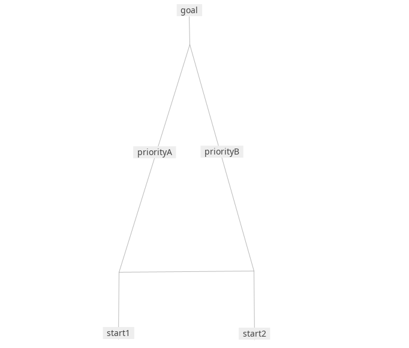

# Multi-Route Priority
エージェントタイプごとに優先ルートが異なる場合

## Map


## Design
- スタート地点は2箇所（start1, start2）
- ゴール地点は1箇所（goal）
- 各スタート地点から，AgentTypeA・AgentTypeBが出発
- AgentTypeAは，PriorityAのリンクを優先して選択
- AgentTypeBは，PriorityBのリンクを優先して選択

## Implementation
### Mental Map
`prop.json`
```json
"mental_map_rules": {
    "agentTypeA": ["if", {"":"hasTag", "tag":"priorityA"}, ["/", ":length", 4], ":length"],
    "agentTypeB": ["if", {"":"hasTag", "tag":"priorityB"}, ["/", ":length", 4], ":length"]
}
```
priority?のLinkの長さを $1/4$ と認識させる

### Agent Generation
`gen.json`
```json
"agentType": {"className":"RationalAgent",
    "mentalMode":"agentTypeA"
}
```

